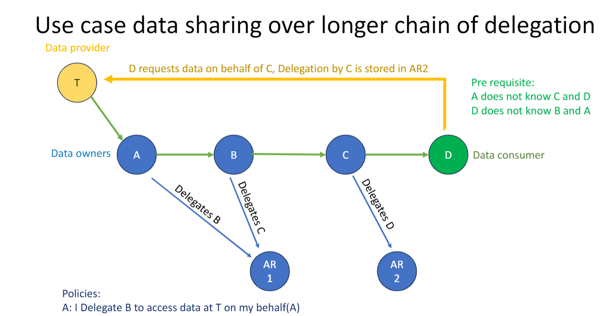

# RFC041: Optimise delegation paths

## Background and rationale

The current iSHARE Framework, as defined on the developer portal, includes the following attributes in the [delegation mask model](https://dev.ishare.eu/delegation/delegation-request.html) that is used for [requesting delegation evidence](https://dev.ishare.eu/delegation/endpoint.html).

- `delegation_path`: Container for one or more iSHARE identifiers values for a situation where multiple delegation policies need to be linked together.
- `previous_steps`: Container for one or more pieces of evidence such that the client has legitimate reason to request delegation evidence. A single step contains either a previous delegationEvidence statement or a client_assertion. The minimum is a client_assertion value of the accessSubject, for example if the Service Provider requests delegationEvidence for an authorization in which he is neither the policyIssuer or the accessSubject.

Specifically in implementations in the logistics domain, in practice delegations are passed on to other parties. Consider for example a use case where a Shipper hires Transporter A, who subcontracts Transporter B, who subcontracts Transporter C, who eventually shows up at a warehouse to pick up goods on behalf of the Shipper. This is called a *delegation chain*.

Different solution scenarios have been tested in different implementations.

## Proposed change

The proposed change is to extend the authorization registry such that it verifies full delegation chains. In part by extending the delegation evidence utilized.

### Purpose

This RFC aims to list possible implementation scenarios with their respective pros and cons and include these in iSHARE's documentation.

### Description and principles

Various delegation models can be employed to manage delegation chains, each with distinct characteristics. The aspects that are discussed for these models are:

- Zero-knowledge: are the parties that are involved in the delegation chain are unaware of their position within the chain. In the example: the Shipper should be unaware of what subcontracted transporters have been hired.
- Efficiency: traversing the delegation chain might require a lot of calls to different parties within the dataspace.
- Long running delegations: some parties might have long running delegations in place, where for instance a Transporter is delegated to access a warehouse for all shipments of a certain Shipper. If there are multiple long running delegations, these will possibly overlap and probably have different start and end dates.

The following principles are relevant:

- Authorisation Registries operate as "zero-knowledge evidence providers". To request evidence, a Service Consumer or Service Provider has to provide all details (issuer, subject (receiver), target/resources/etc.) to the Authorisation Registry, which in return provides the evidence or not. The Authorisation Registry cannot be queried with only part of the request, so as an evidence requester, it is required to know the issuer, subject an target/resources/etc.

Below, several delegation models are described, followed by a comparative table:

**1. Recursively build path - Previous Party ID**
This model involves each piece of delegation evidence storing the identifier of the delegating party (the "previous party"). When validation is required, the Authorization Registry (AR) recursively checks if a valid delegation path can be reconstructed from the access seeker back to the ultimate data owner. This is achieved by looking up the delegation evidence issued to the `prev_party` to the current party, and then repeating the process for that `prev_party`.
This approach offers flexibility, particularly in scenarios with parallel delegation paths, where multiple delegations can converge. For instance, a party might receive rights from two different sources and then delegate a combination of these rights. Revocation of one upstream delegation does not necessarily invalidate downstream delegations if an alternative valid path still exists for the delegating party. Privacy implications are generally minimal, as the delegatee is usually aware of their direct delegator. For cross-AR validation, the evidence should also include the AR identifier where the delegation was issued. Revocation can be handled by maintaining a list of revoked delegation identifiers, which must be checked during path validation.

**2. Recursively build path - Previous Delegation ID**
This model extends delegation evidence with a reference to the identifier of the preceding delegation evidence in the chain. This allows reconstruction and validation of the full path by recursively tracing back to the data owner. Each delegation's validity and revocation status (e.g., by checking against a revocation register) are verified.
This model can support cross-AR validation if the delegation ID include registry prefixes. However, if a specific delegation in the chain is revoked, any subsequent delegations relying on that specific link become invalid.

<!-- **3. Token-based model**
This model uses a single token that is passed along the delegation chain. The token might be validated against a central repository that holds its associated access rights, or the token itself could encapsulate these rights and be cryptographically signed.
Its main advantage is simplicity. However, it has significant security drawbacks: the token is not bound to a specific delegatee, allowing free transfer without oversight. This makes it difficult to enforce fine-grained constraints or track the delegation path. Revocation is coarse, typically at the token level, affecting all holders. -->

**3. Concatenation model**
This model aims to reduce lookup overhead by embedding more chain information within the delegation evidence.
    *   **Full Concatenation:** Each new delegation contains the complete sequence of all previous delegation evidence objects. This makes validation very efficient as the entire path is self-contained. However, it significantly increases evidence size with chain length and poses privacy concerns, as every participant sees all upstream delegation details.
    *   **ID-only Concatenation:** To mitigate the issues of full concatenation, this variant includes only the identifiers of previous delegations (possibly prefixed with the issuing AR's ID). This still allows chain reconstruction without recursive querying but limits information exposure. Privacy is improved as only the position in the chain and identifiers are revealed, not full upstream details unless resolved.
Both variants are compatible with multi-registry environments. The `delegation_path` attribute in the current iSHARE framework aligns with these concatenation models.

**4. External storage model**
Here, the delegation token or evidence is a unique identifier referencing externally stored, detailed delegation evidence. This external evidence contains information about previous parties or delegations in the path.
This decouples the token from the full chain details, enhancing privacy and scalability as parties only access necessary information. A key feature is support for path abstraction; if an intermediate delegation is revoked, the system can potentially recompute or discover an alternative valid path, improving fault tolerance. Validation involves backend lookups to the trusted external storage.

The following table summarizes these scenarios:

| Model                                           | Description                                                                                                                                                                                                         | Zero-knowledge (Shipper unaware of subcontractors?)                                   | Efficiency                                                                                                                              | Long running delegations                                                                                                                                                           |
| -------------------------------------------------- | ------------------------------------------------------------------------------------------------------------------------------------------------------------------------------------------------------------------- | ------------------------------------------------------------------------------------- | --------------------------------------------------------------------------------------------------------------------------------------- | ---------------------------------------------------------------------------------------------------------------------------------------------------------------------------------- |
| 1. Recursively build path - Previous Party ID      | Each delegation stores previous party's ID. AR recursively validates path. Supports parallel paths. (RFC's primary proposal, using `prev_party` from JWT).                                                          | Medium/High (Shipper unaware. Intermediates know direct delegator. AR validates full path.) | Medium (Recursive calls to AR(s); DB lookups. Optimized if within a single AR.)                                                          | Good (Flexible. Revocation of one path doesn't break alternatives. Requires checking revocation list for individual delegations.)                                                 |
| 2. Recursively build path - Previous Delegation ID | Each delegation references ID of previous delegation evidence. AR recursively traces and validates chain.                                                                                                             | High (Similar to Previous Party ID; direct predecessor ID known.)                | Medium (Recursive calls. Each step validated, including revocation status.)                                                             | Good (Supports. Revocation list for delegation IDs needed. Revocation of a link propagates to further links)                                                                     |
| 3. Concatenation model (Full Evidence)             | Each delegation contains the complete sequence of previous delegation evidence. (`previous_steps` attribute mentioned before)                                                                                                | Low/medium (Entire chain information exposed to participants holding the evidence, though information may be limited.)              | Very High (Local validation once evidence obtained.)                                                                                    | Medium (Revocation complex; if one link revoked, entire concatenated evidence potentially invalid unless re-issued or segments checkable.)                                    |
| 4. Concatenation model (ID-only)                   | Each delegation includes identifiers of previous delegations. (`delegation_path` attribute in iSHARE)                                                                                                                 | Medium (Position in chain and IDs known; details not exposed without resolution.)     | High (Chain structure present. Validation efficient but may need to check revocation status of all IDs.)                                | Medium (Similar to Full Concatenation. Revocation of one ID invalidates chain. Requires checking revocation list for all IDs.)                                                   |
| 5. External storage model                          | Delegation token references externally stored delegation evidence/path. Path can be dynamically recomputed.                                                                                                       | Very High (Parties see only necessary info; full chain details not directly exposed.) | Variable (Dependent on external storage retrieval and path computation logic.)                                                          | Very Good (Supports dynamic path re-computation on revocation, allows alternative paths, good fault tolerance.)                                                                    |
<!-- | 3. Token-based model                               | Single token passed along chain, validated centrally or self-contained. Not bound to delegatee.                                                                                                                     | High (Path difficult to track, Shipper likely unaware of specific subcontractors.)    | Variable (High if self-contained; dependent on central repository performance.)                                                         | Poor (Coarse revocation at token level, affecting all holders.)                                                                                                                    | -->
<!-- | 4. Validation on issuing only model                | Per-delegation evidence issued and validated by central authority at issuance. Bound to specific party.                                                                                                             | High (Shipper unaware of subcontracting beyond direct delegatee.)                     | Medium (Validation at issuance. Retrieval of existing evidence is direct.)                                                              | Poor (Inability to propagate revocations downstream effectively.)                                                                                                                  | -->

### Example use cases

An example use case of this RFC is in logistics, such as the one shown in the image at the start of this RFC.

## Impact on the ecosystem

The following table lists the impact of this RFC on the formal iSHARE roles (excluding the Scheme Owner role).

| Formal role               | Technical impact  | Business / legal / functional / operational impact |
| ------------------------- | ----------------- | -------------------------------------------------- |
| Service Consumer          | no                | no                                                 |
| Service Provider          | no                | no                                                 |
| Entitled party            | no                | no                                                 |
| Authorization Registry    | Yes               | yes                                                |
| Identity Provider         | no                | no                                                 |
| Identity Broker           | no                | no                                                 |
| Data Space Administrator  | no                | no                                                 |
| Satellite                 | maybe             | maybe                                              |

The table above describes the required impact, it is possible however based on the details that an impact can be created on other roles as well. E.g. to support multiple authorization registries in a delegation chain, the id of the authorization registry can be added the evidence, or it can be queried from a satellite [creating an impact on the satellite].

## Impact iSHARE Foundation (Scheme Owner)

The proposed changes in RFC041 will impact the iSHARE Foundation and its assets as follows:

- **iSHARE Trust Framework:** The framework will need updates to describe the new delegation path models, evidence structures, and validation requirements.
- **Developer Documentation:** Technical documentation and examples must be extended to cover the new delegation models and validation logic.
- **Reference Implementations (Satellite, Authorization Registry):** Updates are required to support the new evidence structures and validation flows.
- **Test Tools and Conformance:** Test cases and conformance tools should be updated to verify correct implementation of the new models.

These updates will ensure the iSHARE ecosystem remains consistent, interoperable, and aligned with the improved delegation path handling proposed in this RFC.

## Implementation

TBA